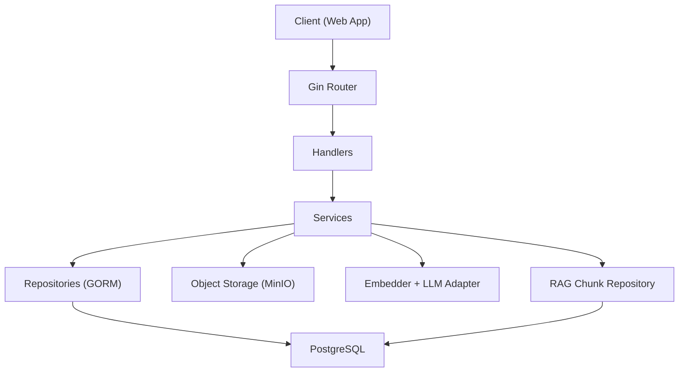
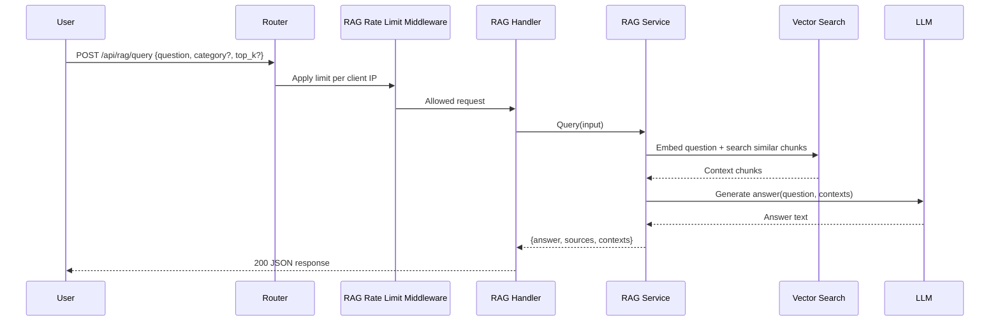

# Smart Doc Go API

Backend service for authentication, authorization, document management, and Retrieval-Augmented Generation (RAG) querying.

## Overview

This API powers two main product surfaces:

1. Admin document operations (protected)
2. Public company knowledge querying via RAG (`POST /api/rag/query`)

The service is built with Gin, GORM, PostgreSQL, object storage (MinIO-compatible), and pluggable embedding/LLM components.

## Backend Architecture

### High-level layers

- `handlers`: HTTP request/response layer
- `routes`: endpoint registration and route-level middleware
- `services`: business logic (auth, docs, permissions, RAG pipeline)
- `repositories`: data access with GORM
- `middleware`: auth, permission checks, CORS, and RAG rate limiting
- `storage`: file/object storage abstraction and MinIO implementation

## Mermaid Architecture Diagram



## How It Works

### 1. Document indexing flow

1. Admin uploads a document through protected document endpoints.
2. `DocumentService` stores the file in object storage.
3. RAG indexing is scheduled in background:
- download file
- extract text (`PDF`/`DOCX`/`plain text`)
- chunk content
- generate embeddings
- store chunks + vectors for similarity search

### 2. Query flow (`POST /api/rag/query`)

1. Public user sends a question.
2. RAG rate-limit middleware checks request quota per client IP.
3. Query text is embedded.
4. Similar chunks are retrieved from vector store.
5. LLM generates final answer from retrieved contexts.
6. API returns:
- `answer`
- `sources` (document IDs)
- `contexts` (matched chunks)

## Mermaid Query Flow



## Important API Endpoints

### Public

- `POST /api/rag/query`
- Queries indexed documents and returns answer + contexts + sources.
- Protected by dedicated rate limiting middleware.

### Auth

- `POST /api/auth/login`
- Authenticates admin user and returns token payload.

### Protected admin/document routes

- `GET /api/documents?category=...`
- `POST /api/documents`
- `PUT /api/documents/:id`
- `DELETE /api/documents/:id`
- `GET /api/documents/:id/download`

### Protected RBAC routes

- `GET/POST/PUT/DELETE` for roles and permissions endpoints
- Category management endpoints

Swagger UI:

- `GET /swagger/*any`

## Services Summary

- `AuthService`: credential validation and login token workflow
- `DocumentService`: upload/update/delete/list docs and schedule indexing
- `RAGService`: indexing pipeline + retrieval + answer generation
- `PermissionService`: role-permission resolution
- `RoleService`: role management
- `DocCategoryService`: document category CRUD

## Middleware Summary

- `CORSMiddleware`: frontend origin and headers policy
- `AuthMiddleware`: JWT validation for protected routes
- `PermissionsMiddleware`: hydrates user permissions from role IDs
- `RequirePermission`: route-level permission enforcement
- `RequireHeaderPermission`: request-level permission claim check
- `RAGQueryRateLimitMiddleware`: per-IP rate limiting for `/api/rag/query`

Rate limit environment variables:

- `RAG_QUERY_RATE_LIMIT` (default `30`)
- `RAG_QUERY_WINDOW_SECONDS` (default `60`)

## Project Structure

```text
go-api/
  main.go
  internal/
    handlers/
    routes/
    middleware/
    services/
    repositories/
    storage/
    db/
    config/
    models/
```

## Running Locally

1. Configure `.env` values (DB, storage, Gemini/LLM config).
2. Start API:

```bash
go run main.go
```

3. Open Swagger docs:

```text
http://localhost:8080/swagger/index.html
```

## Notes

- RAG service can be disabled automatically if embedder/LLM initialization fails.
- Admin flows remain protected; only `POST /api/rag/query` is intentionally public.
